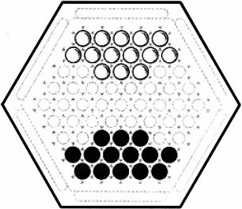
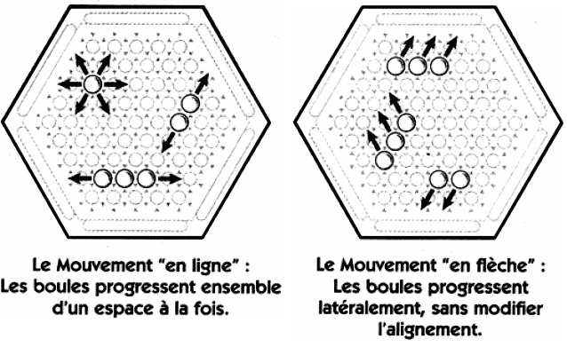

# Règles du jeu

État initiale du plateau :

## Règles

### Ordre de jeu

Chaque joueur joue l'un après l'autre. Et les blancs commencent.

### Mouvements

Les joueurs peuvent déplacer 1 à 3 boules de la manière décritent ce-dessous, d'un case.

### Sumito

Le sumito permet de pousser les boules de l'adversaire. Le sumito n'est possible que si votre poussé est en supériorité numérique.

C'est a dire qu'une ligne de 3 boules peut pousser une ligne de 2 boules ou moins, mais pas 3.

### Limite de temps

Une partie ne peut pas durée, plus de 15 minutes.

### Condition de victoire

Le premier joueur qui éjecte 6 boules adverses en dehors du plateau gagne.